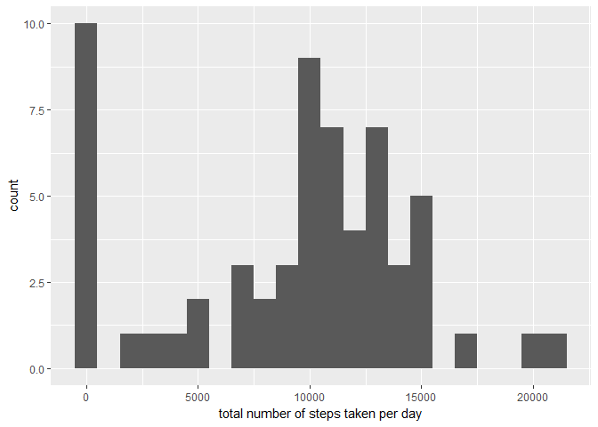

# Reproducible Research - Assignment 1
Saptarshi Lahiri  
3 June 2017  


## Reading, Loading and preprocessing the data
## 1. Setting working directory
## 2. Reading Data
## Total 17568 obs. of 3 variables


```r
setwd("E:/DataScience/Workspace/Reprod-Rsearch")
data <- read.csv("activity.csv")
```

## What is mean total number of steps taken per day?
## 1. Using ggplot2
## 2. Compute total steps by applying sum
## 3. Plot
## 4. Calculate mean
## 5. Calculate median


```r
library(ggplot2)
```

```
## Warning: package 'ggplot2' was built under R version 3.3.3
```

```r
total.steps <- tapply(data$steps, data$date, FUN=sum, na.rm=TRUE)
qplot(total.steps, binwidth=1000, xlab="total number of steps taken per day")
```

<!-- -->

```r
mean(total.steps, na.rm=TRUE)
```

```
## [1] 9354.23
```

```r
median(total.steps, na.rm=TRUE)
```

```
## [1] 10395
```
## What is the average daily activity pattern?
## 1. Average total steps wrt mean
## 2. Plotting

```r
library(ggplot2)
averages <- aggregate(x=list(steps=data$steps), by=list(interval=data$interval),
                      FUN=mean, na.rm=TRUE)
ggplot(data=averages, aes(x=interval, y=steps)) +
    geom_line() +
    xlab("5-minute interval") +
    ylab("average number of steps taken")
```

<!-- -->
##The 5-minute interval that, on average, contains the maximum number of steps
## Obtain max number of steps

```r
averages[which.max(averages$steps),]
```

```
##     interval    steps
## 104      835 206.1698
```
## 1. Identify missing values
## 2. Replace missing values with mean values (remembering Rattle)


```r
missing <- is.na(data$steps)

table(missing)
```

```
## missing
## FALSE  TRUE 
## 15264  2304
```

```r
fill.value <- function(steps, interval) {
    filled <- NA
    if (!is.na(steps))
        filled <- c(steps)
    else
        filled <- (averages[averages$interval==interval, "steps"])
    return(filled)
}
filled.data <- data
filled.data$steps <- mapply(fill.value, filled.data$steps, filled.data$interval)

total.steps <- tapply(filled.data$steps, filled.data$date, FUN=sum)
qplot(total.steps, binwidth=1000, xlab="total number of steps taken each day")
```

<!-- -->

```r
mean(total.steps)
```

```
## [1] 10766.19
```

```r
median(total.steps)
```

```
## [1] 10766.19
```

##Are there differences in activity patterns between weekdays and weekends?
## 1. Writing function block for weekday or weekend
## 2. Two plots for weekday and weekend


```r
WDayOrWEnd <- function(date) {
    day <- weekdays(date)
    if (day %in% c("Monday", "Tuesday", "Wednesday", "Thursday", "Friday"))
        return("weekday")
    else if (day %in% c("Saturday", "Sunday"))
        return("weekend")
    else
        stop("invalid date")
}
filled.data$date <- as.Date(filled.data$date)
filled.data$day <- sapply(filled.data$date, FUN=WDayOrWEnd)

averages <- aggregate(steps ~ interval + day, data=filled.data, mean)
ggplot(averages, aes(interval, steps)) + geom_line() + facet_grid(day ~ .) +
    xlab("5-minute interval") + ylab("Number of steps")
```

<!-- -->

